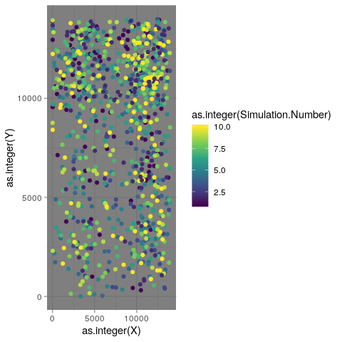

<!-- README.md is generated from README.Rmd. Please edit that file -->

# trapgridR

<!-- badges: start -->

<!-- badges: end -->

trapgridR is an interace for the java program “TrapGrid” (Manoukis et
al. 2015) using R. Calling this program from R allows for multiple
simulations to be run, and the results to be easily collated and
summarised.

## Installation

Prior to installation, make sure you have `{rJava}` installed and
working. This may require installation of Java first. For example on
Ubuntu:

`sudo apt-get install -y default-jre`

`sudo apt-get install -y default-jdk`

`sudo R CMD javareconf`

You can install the development version from
[GitHub](https://github.com/) with:

``` r
# install.packages("devtools")
devtools::install_github("mattecologist/trapgridR")
```

## Example

``` r
library(trapgridR)
#> Loading required package: rJava
```

There is a simple function to make a regular grid across a given area

``` r
make_regular_grid("my_grid")
```


    #> [1] "Trapping grid  my_grid written"

Simulations can be setup in R and results stored as
objects

``` r
model1 <- trapgridR(filepath="my_grid", nDays = 14, nFlies = 100, nSim=10, D=10^5)
```

Simulation results can be plotted from the model objects

``` r
library (ggplot2)
ggplot(model1$simRuns, aes(Day, 1-Cumulative.Escape.Probability, colour=SimRun, group=SimRun))+
  geom_line()+
  theme_dark()+
  scale_x_continuous(expand=c(0.01,0))+
  scale_y_continuous(expand=c(0,0.01))
```


Additionally, fly locations from the simulation can be plotted to
examine movement
patterns….

``` r
ggplot (model1$flyLoc, aes(as.integer(X), as.integer(Y),  colour=as.integer(Simulation.Number)))+
  geom_point()+
  facet_wrap(.~as.integer(Day))+
  scale_colour_viridis_c()+
  theme_dark()
```


…..which is a bit messy, so using `{gganimate}` can make an animation:

``` r
library (gganimate)
ggplot (model1$flyLoc, aes(as.integer(X), as.integer(Y),  colour=as.integer(Simulation.Number)))+
  geom_point()+
  transition_time(as.integer(Day)) +
  scale_colour_viridis_c()+
  theme_dark()
```



We’ve included functions so that actualy trap arrangements can be easily
be used in R, and are implementing further changes to the model that
allow specification of further biological and trapping parameters.

# References

Manoukis, Nicholas C., Brian Hall, and Scott M. Geib. “A Computer Model
of Insect Traps in a Landscape.” Scientific Reports 4, no. 1 (May 2015).
<https://doi.org/10.1038/srep07015>.
