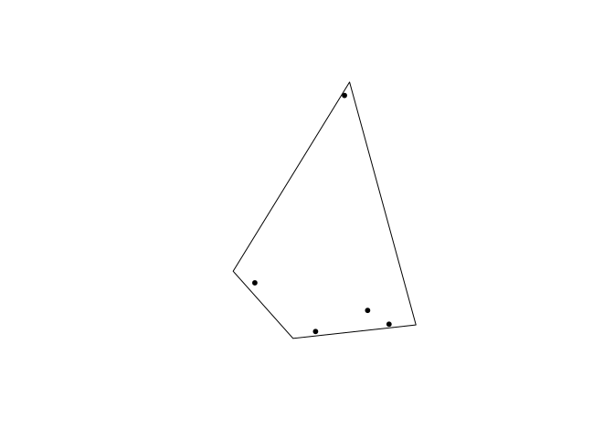
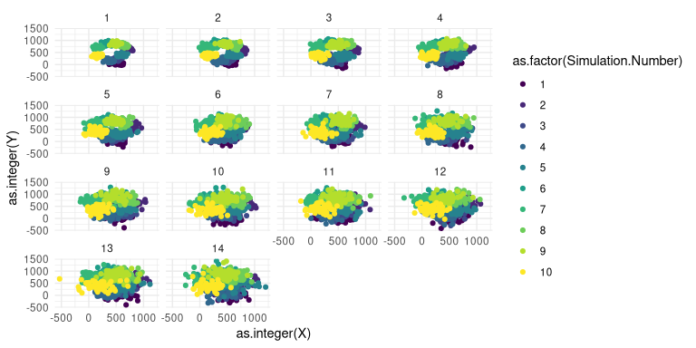

<!-- README.md is generated from README.Rmd. Please edit that file -->

# trapgridR

<!-- badges: start -->

<!-- badges: end -->

trapgridR is an interace for the java program “TrapGrid” (Manoukis et
al. 2015) using R. Calling this program from R allows for multiple
simulations to be run, and the results to be easily collated and
summarised.

## Installation

Prior to installation, make sure you have `{rJava}` installed and
working. This may require installation of Java first. For example on
Ubuntu:

`sudo apt-get install -y default-jre`

`sudo apt-get install -y default-jdk`

`sudo R CMD javareconf`

You can install the development version from
[GitHub](https://github.com/) with:

``` r
# install.packages("devtools")
devtools::install_github("mattecologist/trapgridR")
```

## Example

``` r
library (trapgridR)
#> Loading required package: rJava
library (ggplot2)
library (sp)
library (raster)
library (maptools)
#> Checking rgeos availability: TRUE
```

At the most basic level, there is a simple function to make a regular
grid across a given area

``` r
make_regular_grid("my_grid", #name of file to write out for TrapGrid
  gridSize = c(364, 572), # upper right corner coordinates (lower left is always 0, 0)
  gridSpace = 80, # spacing of traps in metres
  lambda = 0.02) # lambda of the traps
```


    #> [1] "Trapping grid  my_grid written"
    #>       [,1] [,2] [,3]
    #>  [1,]    0    0 0.02
    #>  [2,]    0   80 0.02
    #>  [3,]    0  160 0.02
    #>  [4,]    0  240 0.02
    #>  [5,]    0  320 0.02
    #>  [6,]   80    0 0.02
    #>  [7,]   80   80 0.02
    #>  [8,]   80  160 0.02
    #>  [9,]   80  240 0.02
    #> [10,]   80  320 0.02
    #> [11,]  160    0 0.02
    #> [12,]  160   80 0.02
    #> [13,]  160  160 0.02
    #> [14,]  160  240 0.02
    #> [15,]  160  320 0.02
    #> [16,]  240    0 0.02
    #> [17,]  240   80 0.02
    #> [18,]  240  160 0.02
    #> [19,]  240  240 0.02
    #> [20,]  240  320 0.02
    #> [21,]  320    0 0.02
    #> [22,]  320   80 0.02
    #> [23,]  320  160 0.02
    #> [24,]  320  240 0.02
    #> [25,]  320  320 0.02
    #> [26,]  400    0 0.02
    #> [27,]  400   80 0.02
    #> [28,]  400  160 0.02
    #> [29,]  400  240 0.02
    #> [30,]  400  320 0.02
    #> [31,]  480    0 0.02
    #> [32,]  480   80 0.02
    #> [33,]  480  160 0.02
    #> [34,]  480  240 0.02
    #> [35,]  480  320 0.02
    #> [36,]  560    0 0.02
    #> [37,]  560   80 0.02
    #> [38,]  560  160 0.02
    #> [39,]  560  240 0.02
    #> [40,]  560  320 0.02

Or make a random grid of at least a minimum distance apart, that can
include additional perimeter traps or not

``` r
make_random_grid(n.traps=5, gridname="my_grid", perim=TRUE)
```


    #>       [,1] [,2] [,3]
    #>  [1,] 1690    0 0.02
    #>  [2,] 1438 2000 0.02
    #>  [3,] 2000 1019 0.02
    #>  [4,]    0 1432 0.02
    #>  [5,]   38  550 0.02
    #>  [6,]  676  713 0.02
    #>  [7,] 1819 1847 0.02
    #>  [8,] 1188 1447 0.02
    #>  [9,] 1064  964 0.02

## Simulating Orchards / Management areas

Alternatively, you might have a polygon/shapefile of an orchard you want
to explore different scenarios over. You can also build randomly shaped
and sized polygons to investigate. We were interseted in orchard
“blocks” so have used that term to describe them, but it can be any
management area that is appropriate.

``` r
new.block <- make_random_block()  #specify the size of the block in metres squared

new.traps <- make_random_traps(block=new.block, n.traps = 5, min.dist = 50) # add traps to the block - here just 4 random traps all at least 50 meters apart


plot (new.block) # the traps object stores the new block polygon too
points (new.traps[[1]], pch=20) # the traps are here as point
```



# Setting outbreak locations

Its possible to take the block polygon and seed all the outbreaks either
within or outside of the block

``` r
outbreaks <- make_block_outbreak(traps= new.traps[1], block = new.traps[[2]],
                                 nOutbreaks = 10)
#> [1] "Outbreak file outbreaks written"

plot (outbreaks$buffer_region)
points (outbreaks$outbreak_set)
points (outbreaks$traps_sp, pch=20)
```


``` r
make_block_grid(gridname = "orchard_traps",
                traps = outbreaks$traps_sp,
                lambda = 0.05)
#> [1] "Trapping grid  orchard_traps written"
```

``` r
model.temp <- trapgridR("orchard_traps", nDays=14, nFlies=50, D=10^3,
                        outbreaks = "outbreaks")
```

Simulations can be setup in R and results stored as objects

``` r
model1 <- trapgridR(filepath="my_grid", nDays = 14, nFlies = 10, nSim=20, D=10^5)
```

Simulation results can be plotted from the model objects.

``` r
library (ggplot2)
ggplot(model.temp$simRuns, aes(Day, 1-Cumulative.Escape.Probability))+
  geom_line(aes(group=SimRun), colour=viridis::viridis(3)[1], alpha=0.3)+
  geom_smooth(method="loess", colour=viridis::viridis(3)[2])+
  theme_dark()+
  scale_x_continuous(expand=c(0.01,0))+
  scale_y_continuous(expand=c(0,0.01))+
  theme_minimal()
#> `geom_smooth()` using formula 'y ~ x'
```


The 1-cumulative escape probability can be thought of as the detection
probability - which only reaches around 0.25 after 2 weeks in this
example.

Additionally, fly locations from the simulation can be plotted to
examine movement patterns….

``` r
ggplot (model.temp$flyLoc, aes(as.integer(X), as.integer(Y),  colour=as.factor(Simulation.Number)))+
  geom_point()+
  facet_wrap(.~as.integer(Day))+
  scale_colour_viridis_d()+
  theme_minimal()
```



We’ve included functions so that actualy trap arrangements can be easily
be used in R, and are implementing further changes to the model that
allow specification of further biological and trapping parameters.

# References

Manoukis, Nicholas C., Brian Hall, and Scott M. Geib. “A Computer Model
of Insect Traps in a Landscape.” Scientific Reports 4, no. 1 (May 2015).
<https://doi.org/10.1038/srep07015>.
